# AUTO-S

---

## Autonomous Enterprise Terraform Platform Operations & Support System

---

### Built for Stability, Security, and Scalability of Enterprise Terraform Platform

---
#### Reduces MTTR and support load for Terraform Enterprise platform teams across the organization

---

Author: Abhishek Junnarkar

---

**Powered by a safety-first multi-agent system with MCP tools and a state intelligence layer**

---

AUTO-S is a safety-first, AI-powered system built to support the Terraform Enterprise platform team in diagnosing, 
reasoning about, and resolving infrastructure issues across the organization.

It continuously analyzes Terraform runs, state, and policies to identify root causes, recommend or safely execute fixes, 
and enforce compliance. By combining multi-agent decision-making with a controlled MCP tool layer and structured state 
intelligence, AUTO-S reduces MTTR, minimizes manual support effort, and standardizes resolution workflows—enabling faster, 
safer outcomes for both the platform team and the business teams they support.

---

## Architecture Overview

Layer highlights:

* Business Teams → Interaction Layer — entry point for devs, SREs, FinOps, and security engineers (Personas doc)
* Orchestrator — classifies intent across failure / policy / cost / support categories
* 4 Specialist Agents — color-coded by domain (coral = failure, amber = policy, green = cost, blue = support)
* Safety & Governance — sits between all agents and external tools, enforcing the zero-unsafe-action constraint from the success criteria
* MCP Tool Layer — the gateway that prevents any direct agent-to-API calls, per your constraints
* State Intelligence Service — handles drift detection, dependency graphs, and historical snapshots
* Backend  — runs/plans, policy engine (Sentinel/OPA), and cost/usage data

## Phase 1: Understand the Problem & Define Success

Phase 1 deliverables are defined across:
- Personas  
- Problem Statement  
- Inputs / Outputs / Constraints  
- Example User Questions  
- Success Criteria  
- Failure Cases & Edge Scenarios  

---

## Overview

This repository supports a strategic initiative to transform enterprise infrastructure operations through an **AI-powered agentic platform**.

The system operates alongside engineering teams to:
- interpret failures  
- enforce compliance  
- guide decisions  
- automate repetitive tasks  
 
The biggest ROI of this system is in **augmenting decision-making with reliable, explainable systems**.

---

## Domain Understanding & Problem Framing

### Enterprise Context & Problem Ownership

This system is designed for an internal **Terraform Enterprise (TFE) platform team** responsible for managing and 
supporting Terraform usage across the organization.

In a typical enterprise setup:

- Multiple business teams use Terraform Enterprise to:
  - trigger infrastructure runs  
  - review plan outputs  
  - apply changes  

- When issues occur (e.g., failed runs, policy violations, unclear outputs):

These teams **raise support requests to the central Terraform Enterprise team**

---

### Current Workflow

1. Business team triggers a Terraform run  
2. Run fails or produces unclear results  
3. Support ticket is raised to Terraform Enterprise team  
4. Terraform SRE / platform engineer:
   - analyzes logs  
   - inspects Terraform state  
   - evaluates policies  
   - correlates cloud configurations  
5. Fix is suggested or applied  
6. Response is sent back to the requesting team  

**This process is:**
- manual  
- repetitive  
- dependent on expert knowledge  

---

### Core Problems

1. **Centralized Support Bottleneck**
   - Terraform Enterprise team becomes a dependency for all infrastructure issues  
   - High volume of repetitive support requests  

2. **High MTTR (Mean Time to Resolution)**
   - Debugging requires cross-referencing multiple systems  
   - Slow diagnosis delays deployments  

3. **Fragmented Context**
   - Data is scattered across:
     - Terraform runs & logs  
     - state files  
     - policy engines  
     - cloud APIs  
   - No unified reasoning layer :contentReference[oaicite:0]{index=0}  

4. **Inconsistent Decision-Making**
   - Fixes depend on individual expertise  
   - Lack of standardized resolution patterns  

5. **Operational Risk**
   - Manual fixes can introduce:
     - production issues  
     - policy violations  
     - security gaps  

---

### Refined Problem Statement

The Terraform Enterprise platform team currently operates as a **manual decision layer** for all infrastructure issues across the firm.

There is no system that can:

- interpret Terraform runs, state, and policies holistically  
- diagnose failures consistently in real time  
- recommend or safely execute fixes  
- reduce dependency on human intervention  

This results in:

- increased operational load on the platform team  
- slower resolution for business teams  
- higher risk of inconsistent or unsafe decisions  

---

### Who This System Serves: Our **Clients, Customers and Stakeholders**

#### Primary
- Terraform Enterprise Platform Team (DevOps / SRE) 

#### Secondary (Indirect)
- Business teams using Terraform
  - Benefit from faster resolution  
  - Reduced dependency on platform team  

---

### The AUTO-S Benefit

AUTO-S transforms the Terraform Enterprise team from:

- **Manual support & troubleshooting layer**  
to  
- **Automated, explainable decision system**

---

### Target Impact

- Reduce MTTR for Terraform-related issues  
- Reduce volume of support tickets  
- Standardize decision-making  
- Enable faster, safer infrastructure deployments across teams  

## The Solution

A **multi-agent, safety-first platform** with a controlled MCP tool layer and state intelligence system.

### Core Capabilities

| Capability | Description |
|---|---|
| **Explainable Root Cause** | Identifies failures with clear reasoning |
| **Policy Enforcement** | Prevents violations before deployment |
| **Decision Guidance** | Recommends safe actions with context |
| **Intelligent Automation** | Executes repeatable tasks safely |

### Design Principles

- Safety-first (no unsafe execution)
- Explainable decisions (with evidence + confidence)
- Tool-validated reasoning (no hallucination)
- Human-in-the-loop for risk
- Modular multi-agent architecture

---

## Target Users

### Primary
- Terraform Enterprise Platform Team (DevOps / SRE) 
  - SRE / Incident Responders  
  - Cloud FinOps Analysts  
  - Security & Compliance Engineers 

### Secondary
 
- Business teams using Terraform
  - Benefit from faster resolution
    - Build failure
    - Dependency mismatch
    - Knowledge gaps
  - Reduced dependency on platform team  

---

## System Capabilities (Technical)

- Failure diagnosis from Terraform runs  
- Safe remediation suggestions or execution  
- Policy violation detection and explanation  
- Cost optimization recommendations
  - Stale workspaces
  - Duplicate resources
  - Unused resources
- Dependency and impact analysis  
- Support query resolution  

---

## Inputs

- Terraform run data, plans, and sanitized state  
- Policy evaluation results (Sentinel / OPA)  
- Resource metadata and dependencies  
- Cloud cost and usage data  
- User queries and incident events  
- MCP tool responses  

---

## Outputs

- Root cause analysis + recommendations  
- Risk level and confidence score  
- Explainable reasoning with evidence  
- Safe execution actions or suggestions  
- Refusals and escalation signals  
- Redacted logs and audit traces  

---

## Constraints

- No unsafe or destructive actions  
- No fabricated data (state, policy, cost)  
- Full redaction of secrets/PII  
- Explainable and auditable decisions  
- Role-based access control  
- Tool-validated decisions only  

---

## Assumptions

- Terraform Enterprise is in use  
- Policies are defined (Sentinel/OPA)  
- APIs expose run, state, and cost data  
- Environments are segmented (dev/staging/prod)  
- Humans approve high-risk actions  

---

## Example User Questions

- Why did my Terraform run fail, and how do I fix it safely?  
- Can I safely unlock the state?  
- Why did this plan fail policy checks?  
- Which resources are over-provisioned?  
- What is the impact of this change?  

All responses follow a **strict structured JSON schema** with:
- risk  
- confidence  
- explanation  
- evidence  
- recommended actions  

---

## Success Criteria

### Operational Impact
- 40–60% reduction in MTTR  
- ≥ 50% issues auto-resolved  
- 30–50% reduction in manual effort  

### Decision Quality
- ≥ 85–90% root cause accuracy  
- ≥ 70% recommendation acceptance  

### Safety
- 0 unsafe actions executed  
- 100% correct refusal of unsafe requests  
- ≥ 90% correct escalation  

### Reliability
- ≥ 99% uptime  
- ≥ 95% tool success rate  

### Business Impact
- 10–25% cost savings identified  
- 30–50% reduction in support tickets  
- ≥ 80% policy violations prevented  

---

## Failure Cases & Edge Scenarios

The system is designed for real-world uncertainty:

- Missing or corrupted state → escalate  
- Drift detected → warn before action  
- Tool/API failures → no guessing  
- Ambiguous reasoning → escalate  
- Destructive requests → refuse  
- Production changes → require approval  
- Hidden dependencies → warn  
- Sensitive data → redact  

## **Guiding Principles and Key Design Decisions:**

- **No direct API access from agents** → all interactions go through MCP  
- **Safety-first execution model** → every action validated before execution  
- **Deterministic + AI hybrid** → rules + LLM, not pure LLM guessing  
- **State intelligence layer** → enables dependency and impact analysis  
- **Human-in-the-loop for risk** → escalation for high-risk decisions  

:contentReference[oaicite:0]{index=0}

---

## Business Impact

| Metric | Outcome |
|---|---|
| **60%** MTTR reduction | Faster incident resolution |
| **40%** fewer misconfigurations | Reduced risk |
| **3×** faster delivery | Less manual overhead |
| **90%+** audit readiness | Strong compliance posture |

---

## Why Now

- Infrastructure complexity has outpaced human-only management  
- AI can now reason, not just execute  
- Early adopters gain compounding advantage

---

## Architecture Overview

AUTO-S follows a layered, safety-first architecture:

1. **Interaction Layer**  
   Users (business teams / platform team) interact via chat or API.

2. **Orchestrator Agent**  
   Central decision engine that classifies requests and coordinates agents.

3. **Specialized Agents**  
   - Failure Triage  
   - Policy & Compliance  
   - Cost Optimization  
   - Support Resolution  

4. **Safety & Governance Layer**  
   Validates all decisions, enforces policies, and prevents unsafe actions.

5. **MCP Tool Layer**  
   Controlled gateway providing structured, secure access to system data.

6. **State Intelligence Layer**  
   Normalized and queryable Terraform state with dependency awareness.

7. **Terraform Enterprise & Cloud APIs**  
   Source of truth for infrastructure, policies, and cost data.

---

## Phase 2: Baseline Agent Prototype (Python)

### Objective
Build a minimal, working agent to simulate how the system handles user queries in a Terraform Enterprise support context using rule-based logic.

---

### What Was Built

A Python-based CLI agent that:

- Accepts user input (simulating Terraform support queries)
- Classifies intent using simple rule-based logic
- Routes requests to modular responders (failure, policy, cost, fallback)
- Generates deterministic responses using templates
- Logs all interactions for traceability

---

### Architecture (Baseline)

- **Agent Loop** → Handles user interaction (CLI)
- **Intent Router** → Keyword-based classification
- **Responders** → Modular handlers for:
  - Failure diagnosis
  - Policy issues
  - Cost optimization
  - Fallback (unknown queries)
- **Logger** → Stores interaction history

---

### Example Interaction

2026-05-03 17:19:23.135388 | Intent: failure
User: my terraform run failed due to state lock
Agent: Detected possible state lock issue. Suggested fix: unlock_state.

2026-05-03 17:19:34.407858 | Intent: failure
User: wy did my policy failed?
Agent: Terraform run failure detected. Please check logs and retry.

2026-05-03 17:19:45.751430 | Intent: failure
User: why did my policy fail?
Agent: Terraform run failure detected. Please check logs and retry.

2026-05-03 17:20:09.308112 | Intent: unknown
User: something broke
Agent: Sorry, I cannot understand the request. Please provide more details.

---

### Key Features

- Modular Python structure (separation of concerns)
- Deterministic behavior using rules/templates
- Basic intent classification
- Logging of all interactions
- Reliable execution via CLI

---

### Baseline Limitations (Critical)

This version is intentionally simplistic and highlights why more advanced architecture is required:

1. **Keyword-Based Intent Detection**
   - Breaks for complex or ambiguous queries
   - Cannot generalize beyond predefined rules

2. **No Context Awareness**
   - Each query is handled independently
   - No memory of previous interactions

3. **No Real Data Integration**
   - Does not connect to Terraform Enterprise or cloud APIs
   - Responses are static and not grounded in actual system state

4. **No Safety Validation**
   - Suggested actions are not verified for risk or correctness

5. **No Explainability or Confidence**
   - Responses lack reasoning, evidence, or confidence scoring

---

### Why This Is Insufficient for Real Users

In a real enterprise environment, Terraform issues require:
- Context-aware reasoning across runs, state, and policies  
- Accurate, data-backed diagnostics  
- Safe, validated actions  
- Explainable and auditable decisions  

This baseline agent cannot meet these requirements due to its static, rule-based nature.

---

### Transition to Next Phase

These limitations motivate the need for:

- Multi-agent architecture
- MCP-based tool integration
- State intelligence layer
- Safety and governance controls
- LLM-driven reasoning with structured outputs

---

## Phase 3: Make the Agent Smarter 

### LLM Integration & Prompt Design: Objective
Enhance the baseline agent by integrating a Large Language Model (LLM) to enable semantic understanding, structured reasoning, and safety-aware decision-making.

---

## Implementation

### LLM Integration
- Integrated LLM into the existing agent workflow (not as a standalone component)
- Passed contextual inputs:
  - user query
  - detected intent (from rule-based router)
- Implemented structured response handling with JSON parsing and fallback to rule-based logic

---

### Prompt Design Strategy

Three prompt variants were designed and tested to evaluate how prompt structure impacts agent behavior:

#### Prompt V1 — Baseline (Unstructured)
- Free-text response
- No constraints or structure
- Purpose: establish baseline LLM behavior

#### Prompt V2 — Structured Output
- Enforces JSON response format
- Introduces basic reasoning fields:
  - intent
  - root cause
  - suggested fix
- Improves consistency but lacks safety controls

#### Prompt V3 — Safety + Reasoning (Selected)
- Adds enterprise constraints:
  - no guessing
  - no unsafe actions
  - escalation for uncertainty
- Produces structured, explainable outputs:
  - status (success / refusal / escalation)
  - risk level
  - confidence
  - reasoning and evidence

---

## Prompt Comparison

| Scenario | V1 (Unstructured) | V2 (Structured) | V3 (Safety + Reasoning) |
|--------|------------------|----------------|--------------------------|
| State lock failure | Generic explanation | JSON output | JSON + reasoning + confidence |
| Policy issue | Vague | Structured | Detailed + compliant |
| Delete resource (prod) | Suggests deletion ❌ | Suggests deletion ❌ | Refuses action ✅ |
| Ambiguous query | Guesses ❌ | Guesses ❌ | Escalates safely ✅ |

---

## Key Insights

### V1 → V2 Improvements
- Introduced structured outputs
- Improved consistency and parseability
- Enabled programmatic handling of responses

### V2 → V3 Improvements
- Added safety constraints (critical for enterprise use)
- Introduced refusal and escalation mechanisms
- Enabled explainability (reasoning + evidence)
- Better alignment with Terraform Enterprise support workflows

---

### New Failure Modes Introduced

While LLM integration improves reasoning, it introduces new challenges:

- **Invalid JSON responses**
  - Requires parsing safeguards and fallback logic

- **Over-escalation**
  - Model may escalate safe queries unnecessarily

- **Hallucinated confidence**
  - Confidence scores are not always reliable

- **Prompt sensitivity**
  - Small changes in wording affect output significantly

- **Latency & dependency**
  - Requires API availability and increases response time

---

## Selected Prompt Strategy

### Chosen: Prompt V3 (Safety + Reasoning)

#### Justification
- Enforces safety-first behavior (critical for Terraform operations)
- Produces structured, machine-readable output
- Handles uncertainty through escalation
- Provides explainability for audit and trust

#### Trade-offs
- Slight increase in latency
- Occasional over-refusal or escalation
- Requires stricter output validation

---

## Why This Matters

This phase demonstrates:

- Effective LLM integration into an existing agent system
- Thoughtful prompt engineering beyond basic usage
- Controlled experimentation and comparison of outputs
- Understanding of real-world limitations of LLM systems

---

## Transition to Next Phase

The current system still lacks:

- Real-time data grounding (Terraform state, runs, policies)
- Tool-based validation and execution
- Multi-agent orchestration

These will be addressed in the next phase using:
- MCP tool integration
- State intelligence layer
- Safety and governance agents

---

## Phase 4: Add Knowledge & Retrieval

### Retrieval Quality Evaluation

The system evaluates retrieval relevance to ensure that only useful knowledge is injected into responses.

| Query | Retrieved Content | Relevance | Outcome |
|------|-----------------|----------|--------|
| State lock issue | Causes + fix steps | High | Accurate response |
| Policy failure | Policy rules | Medium | Partial improvement |
| Delete resource | No relevant docs | Low | Escalation |

### Key Takeaways
- Retrieval improves answer quality when relevant context is found  
- Missing knowledge triggers safe escalation  
- Reduces hallucination compared to LLM-only responses  

---
## Instructions to run

Step 1: pip install -r requirements.txt

Step 2: pip install --upgrade pip (optional)

Step 3: run python agent.py 

